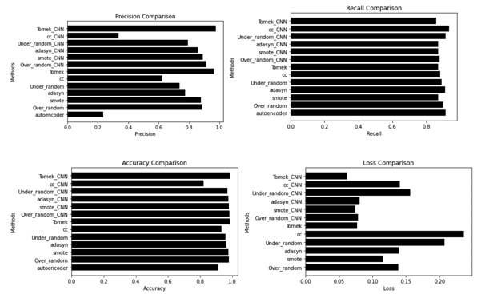

# CREDIT CARD FRAUD DETECTION WITH IMBALANCED CLASSIFICATION APPROACHES
This is for Introduction to Deep Learning Systems Course CSCI-GA 3033

## How to run this code
Please create a folder named "data" and download the dataset here to this folder:

https://www.kaggle.com/mlg-ulb/creditcardfraud

Open main.ipynb in Jupyter Notebook and run every cell

## About
Credit card fraud detection is a cause for severe repercussions for financial institutions and individuals. Hence detection of fraud is an important topic as fraud could lead to changing the lives of people in a bad way. Usually fraud detection is time consuming and many approaches have been developed to alleviate it but most of them are ineffective. One of the major problems is imbalanced data classification. Imbalance classification consists of having a small number of observations of the minority class compared with the majority in the data set. Usually ML researchers try to improve the algorithm and tend to ignore the imbalanced datasets and In turn have poor performance on minority class although the performance on minority class is the one which is important. In this work we test different sampling methods with different ML architectures to find the appropriate design for fraud detection.

## Data

The dataset contains transactions made by credit cards in September 2013 by European cardholders. The dataset is imbalanced, there are only 492 transactions (0.172%) which are fraudulent and the other 284315 transactions (99.828%) are not. It contains only numerical input variables which are the result of a PCA transformation. The information regarding the columns are not provided but the columns that are provided as a sequence of PCA transformation are named as V1, V2 .. V28. These are the principal components obtained after PCA. Time and Amount are features which are given other than the principal components.

## Sampling methods used

Undersampling methods: Random Oversampling, Cluster Centroids, Tomek Links

Oversampling methods: Random Undersampling, SMOTE, ADASYN

## Models

Trained with 3 different models: Autoencoder, ANN, 1D-CNN

## Results

  

